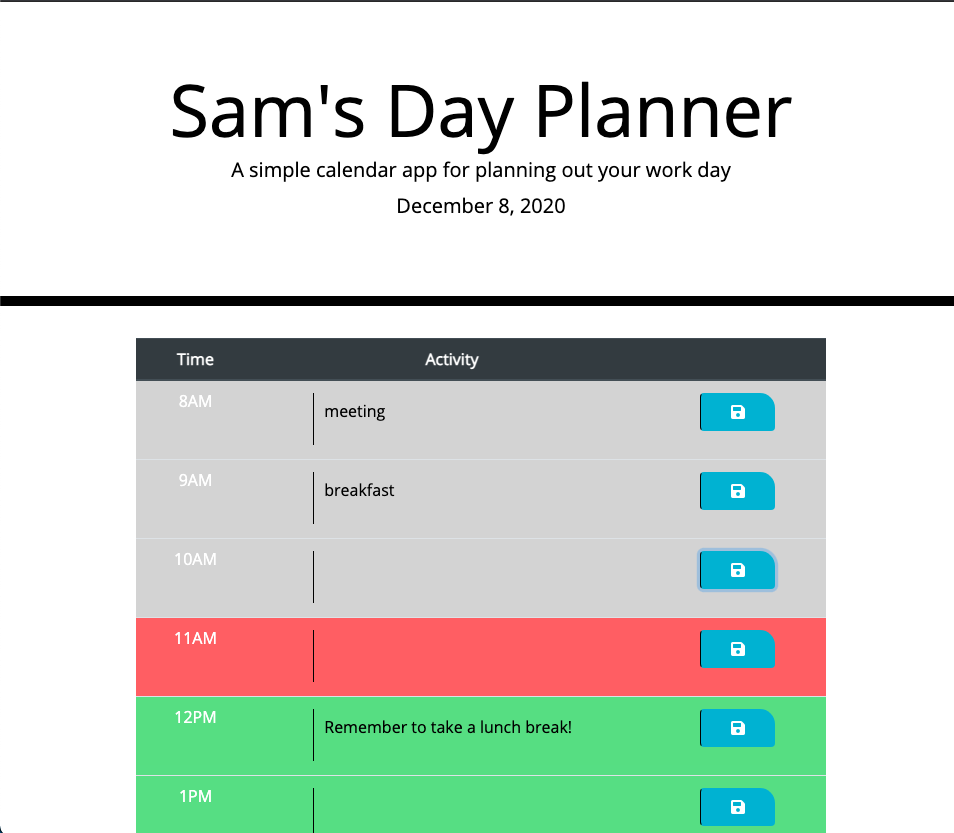

# Sam's Day Planner

## Description
This site contains a single day calendar for you to plan your schedule for the day. As the day progresses, the colors will shift to indicate which hours are past, present and future. Events can be saved and edited throughout the day.

[Deployed Site](https://sfunk11.github.io/day-planner/)

## Steps to Use

1.) Click into any time block and type in your planned activity.

2.) Click the save button in that row.

3.) If desired,  you can close the page, and when reopened (or refreshed), your calendar entries will persist.

